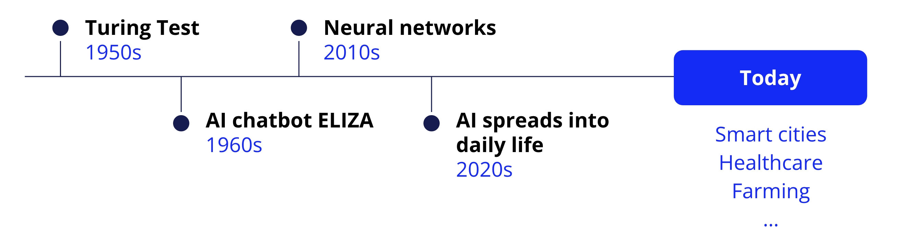
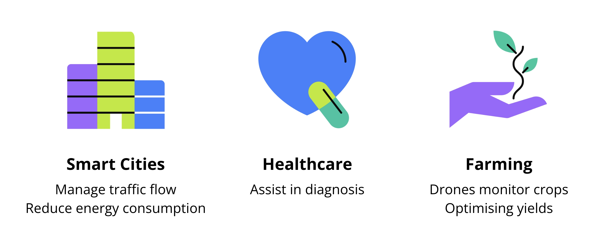
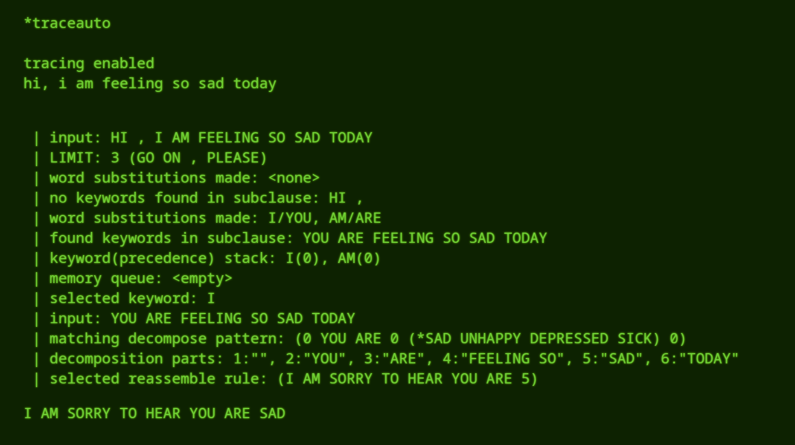
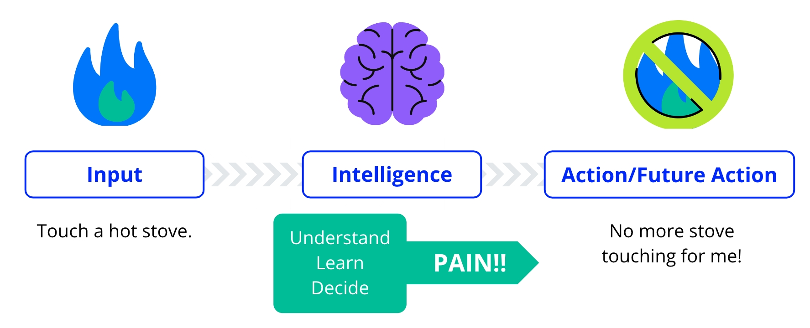

# 🧠 IA Generativa con AWS - Modulo ARTIFICIAL INTELLIGENCE IN CONTEXT

---

## 📆 Información General del Módulo
- **Fecha:**  
- **Título del módulo:**  Artificial Intelligence in  context 
- **Duración del contenido:**  
- **Objetivos del módulo (oficiales):**  
 la evolución de la IA, rastreando sus hitos desde su concepción hasta su ubicuidad actual. Examina criticamente la integración de la IA en diversas industrias, destacando su impacto social transformador. 

- **Mis objetivos (en mis propias palabras):**  
aprender el contexto de la IA como ha avanzado y su actual democratizacion e implementacion global 

---

## 🔁 Conexión con conocimientos previos
> ¿Qué sé sobre este tema antes de comenzar?
-  
-  
-  

---

## 📒 Apuntes principales (Codificación activa del conocimiento)
> Usa tus propias palabras, frases clave, esquemas, analogías o ejemplos.

##  Introduction to IA 
 ¿ que es la inteligenia Artificial ? 
Definimos la Artificial Intelligence (AI) como la emulacion por parte de una o un grupo de computadoras de procesoso de pensamiento - Inteligencia Humana  incluyendo en estos procesos el aprendizaje, el razonamiento, la autocorreccion e incluso el potencial de creatividad, es mas como entender para que se puede aplicar que entender en si su definicion. 

definiremos asi atravez de una comparacion lo que es ia:  
  
  > Imaginemos que una computadora, es un estudiante en un aula. le suministramos informacion o datos y con el tiempo mediante el estudio y la practica adquiere conocimientos y se vuelve más competente. De manera similar a la educacion de un estudiante evoluciona desde el aprendizaje de palabras y números basicos hasta temas complejos, la inteligencia de las computadoras también ha evolucionado 

Historical Development 
 
 Entre los 1940 y 1950 se exploro por primera vez inspirados por el funcionamiento del cerebro Humano, cientificso como Alan Turing plantearon preguntas profundas como: 

 * Puenden las maquinas pensar? 

 esta curiosidad de ver hasta que punto o que aspectos de la inteligencia huamna eran replicables llevó a construir una computadora con sificiente inteligencia artificial para hablar con una persona, ha esta interaccion se le llamo test de turing, que consistia en un test que evaluaba si estabas hablando  con una computadora o con una persona. esto lo que hace es evaluar la capacidad de una maquina una IA para mostrar un comportamiento inteligente con el fin de establecer si estan sofistica para considerarse inteligente a travez de que  no se den cuenta de que estas hablando con una IA

 a medida de los años, la vision era grandiosa pero no existia no habia la tecnologia necesaria y tuvo que ponerce al dia, con el avance del poder computacional y la cantidad de informacion digital del siglo XXI la IA comenzo a avanzar rapidamente. 

 * En 1960 se invento un chatbot llamado ELISA que pretendia ser un terapeuta virtual que podria mantener conversaciones con personas y pretendia entenderlas 

 * Cuando se democratizo el internet y hubo ingentes datos digitales, el ML un subconjunto de la IA, comenzo a avanzar rapidamente permitiendo que las maquinas aprendieran y mejoraran a partir de enormes contidades de datos 
 * En 2010 invetaron mas tipos de aprendizaje  automatico inspirado en las redes neuronales del cerebro humano era la intencion de replicar digitalmente estas estructuras a esto se le llamo Deep Learning o Aprendizaje Profundo estas permitieron que las computadoras pudieran reconocer objetos en imagenes o reconocer la voz de una persona en especifico. 

 * luego se inventaron usando ml computadoras capaces de ganas a humanos en juegops como go, ajedrez entre muchos otros. 

 * Al llegar a la decada de 2020 se democratizo la ia como una tecnologia facinante 

 Hoy en dia la IA esta en todas partes aunque tu no lo veas como lo que te suguiere en redes sociales o los filtros de spam. la magia de extiende mas alla de nuestras pantallas a cosas que nisiquiera nos podemso imaginar.  

  

 por ejemplo: 

 * **Smart Cities** reducen el consumo de electricida y gestionan los flujos de trafico.

 * **Healthcare** la IA ayuda a diagnosticar enfermedades de forma mas temprana y precisa. 

 * **Farming** lso drones impulsadops por IA monitorean los cultivos y optimizan los rendimientos 

 es imprecionante ver como esta pregunta fundamentan de turing en los años 1950 nos a impulsado o solo a computadoras qeu piensan sino de computadoras que impactan cada faceta de nuestra vida. 

 ## Eliza ChatBot by Joseph Weizenbaum en el MIT 

 recordamos anteriromente en la historia de la IA que Eliza fue el primer proyecto de chatbot diseñado en los 60's fue uno de los primeros programa diseñado con la funcion de tener una conversacion  con una persona. una version famosa de este programa emulaba a un psiquiatra repitiendo a menudo lo que decias para dar la sensacion de que hablabas con alguien esto se daaba en que elisa funcionaba respondiendo a eso que decias usando patrones y reglas. 

en la actualidad puedes aceder a una vercion de ELIZA desde su navegador pero sigue siendo el mismo programa original, accede a travez de el siguiente link: 

https://anthay.github.io/eliza.html 

si interactuas con ella descubriras que en verdad responde de manera muy generica y simple en realidad por que no es un modelo ni siquiera carece de una verdadera conprensión en comparacion con las IA's como alexa o chat gpt 

aca vemos un ejemplo temprano del procesamiento de lenguaje natural demostrando desde muy al inicio el potencial de las computadoras para comprender el lenguaje humano, habriendo asi la posibilidad de desarrollar algoritmos y tecnicas mas avanzadas de procesamiento de lenguaje natural lo que ahora nos llevo al desarrollo de la inteligencia artificial actual 

podemso con los comando siguinetes puedes descubrir como ella formula la respues que te da a la solicitud. 

*help  
*traceauto   

luego a la instruccion que le des anterior a su respuesta te muestra como formulo la pregunta. 

pero como desglosamos el entendimiento de este código. 

busca por una parte coincidencia de patrones en tu input/solicitud, podemso entender que funciona basicamente con dos mecanismo que son: 

* **La coincidencia de patrones** divide tu input para reconocer palabras o frases y asi vincularlas con respuestas pre fabricadas 

* **Los sistemas basados en reglas** son un conjunto de instrucciones que le indican al programa que decir cuando reconoce ciertos patrones. 

este modelo aparte tiene la particularidad de devolverte lo que le preguntas reptiendo o reformulandolo con el fin de generar empatia y la sensacion de hablar con un terapeuta. 

Una de las reglas clave de ELIZA es replicar o parafrasear la información del usuario. Esta técnica, frecuentemente utilizada en la psicoterapia rogeriana, crea la ilusión de comprensión y mantiene viva la conversación.

Cuando ELIZA encuentra entradas sin palabras clave ni patrones reconocibles, suele responder con afirmaciones generalizadas o vagas como "Ya veo" o "Continúe, por favor". Esto le permite continuar la conversación sin necesidad de palabras clave específicas.

desglosaremos esto mas: 

en eset ejemplo encontramos que al activar que muestre lo que pasa antes descubrimos que

## Defining Artificial Intelligence 

Definiremos la IA como: 

> IA consiste en simular el razonamiento y los procesos cognitivos similares a los de los seres humanos en computadoras.

* **The Goal** : Es crear sistemas que puedan realizar tareas que al hacerlas los humanos requiren de *Inteligencia* 

tareas como identificar ptrones, reconocer el habla, tomar decisiones y hacer predicciones

Dfiniremos la inteligencia humana como la capacidad de entender, aprender y decidir basandose en la informacion que decidimos, esta inteligencia nos permite procesar la informacion aprendiendo de ella y utilizandola paar fundamentar nuestras acciones futuras. 
  
El proceso de asimilar datos, aprender de ellos y tomar deciciones futuras basadas en ellos es parte fundamental de la inteligencia humana 

Cuando hablamos de inteligencia artificial, pretendemos replicar estos procesos de la capacidad humana pero con ordenadores, esto a travez de programas informáticos sofisticados que pueden procesar enormes cantidades de datos aprender patrones de ellos y leugo tomar decisiones informadas o hacer predicciones basadas en ese conocimiento aprendido 

## Inteligencia Artificial en sociedad 
---

## 🧠 Recuperación activa (sin mirar tus notas)
> Escribe todo lo que recuerdes sin consultar tus apuntes. Luego compáralo y corrige.

-  la prueba de turin consiste en evaluar la capacidad de una maquina de Exhibir un comportamiento inteligente comparable al de un humano. 
-  la enorme cantidad de datos de todo tipo que circulan por internet impulso y acelero significativamente las mejoras en el ML 
- Gracias al aprendizaje profundo que se inspira en redes neuronales del cerebro humano se habrio la pósibilidad de desallo de tecnologias de reconocimiento de objetos y voz. 
 - La IA a evolucionado a lo largo de etapas        
---

## 🔍 Interrogación elaborativa
> ¿Por qué es importante este concepto? ¿Cómo se relaciona con lo anterior?

-  1. Cuando crees que fue la ultima vez que utilizaste inteligencia artificial ? 

si bien cada cosa que te rodea desde tu telefono hasta la sujerencia de lo que veze n cartelera lleva consigo un toque del legado de la IA, esto demuestra que tan entrelazado esta con nuestra existencia diaria 

---

## 🧪 Ejemplos prácticos o casos reales (conexión con contexto)
> Describe ejemplos del uso de IA Generativa en AWS.

-  
-  

---

## 🎯 Evaluación formativa personal (¿Dominé este tema?)
Marca con ✅ si sientes que dominaste, ⚠️ si estás en proceso, ❌ si necesitas reforzar.

| Concepto / Habilidad | Dominio |
|----------------------|---------|
| Comprendo cómo funciona un modelo de IA generativa | ✅ / ⚠️ / ❌ |
| Puedo explicar qué es Amazon Bedrock | ✅ / ⚠️ / ❌ |
| Sé implementar un flujo básico en AWS para IA generativa | ✅ / ⚠️ / ❌ |

---

## 📌 Dudas / Puntos confusos (para revisar luego)
-  
-  

---

## 🔄 Plan de refuerzo (Mastery Learning)
> Define acciones para reforzar lo que no dominaste.

- Leer de nuevo el módulo:  
- Consultar documentación oficial:  
- Hacer una práctica adicional:  
- Ver tutorial complementario:  
- Preguntar en la comunidad/foro:  

---

## ✍️ Enseñando para aprender (Técnica de Feynman)
> Explica uno de los conceptos clave como si se lo enseñaras a un niño de 12 años.

-  
-  

---

## 📈 Reflexión final del día/módulo
> ¿Qué aprendí hoy que puedo aplicar? ¿Qué fue lo más importante?

-  
-  

---
