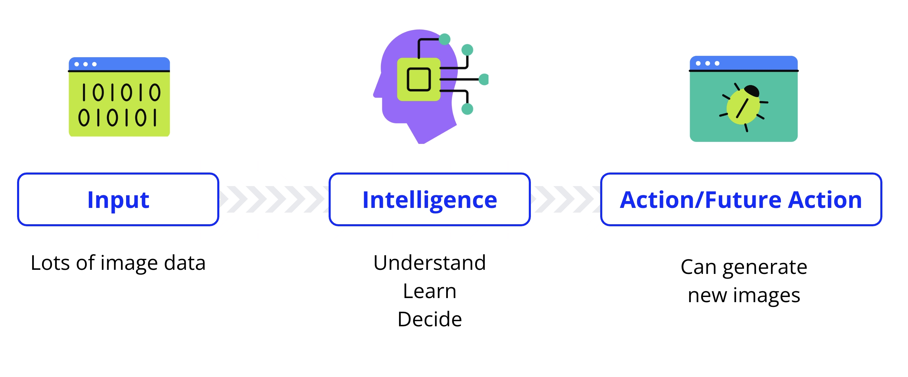

# 🧠 IA Generativa con AWS - Modulo ARTIFICIAL INTELLIGENCE IN CONTEXT

---

## 📆 Información General del Módulo
- **Fecha:**  
- **Título del módulo:**  Artificial Intelligence in  context 
- **Duración del contenido:**  
- **Objetivos del módulo (oficiales):**  
 la evolución de la IA, rastreando sus hitos desde su concepción hasta su ubicuidad actual. Examina criticamente la integración de la IA en diversas industrias, destacando su impacto social transformador. 

- **Mis objetivos (en mis propias palabras):**  
aprender el contexto de la IA como ha avanzado y su actual democratizacion e implementacion global 

---

## 🔁 Conexión con conocimientos previos
> ¿Qué sé sobre este tema antes de comenzar?
-  
-  
-  
---

## 📒 Apuntes principales (Codificación activa del conocimiento)
> Usa tus propias palabras, frases clave, esquemas, analogías o ejemplos.

##  Introduction to IA 
 ¿ que es la inteligenia Artificial ? 
Definimos la Artificial Intelligence (AI) como la emulacion por parte de una o un grupo de computadoras de procesoso de pensamiento - Inteligencia Humana  incluyendo en estos procesos el aprendizaje, el razonamiento, la autocorreccion e incluso el potencial de creatividad, es mas como entender para que se puede aplicar que entender en si su definicion. 

definiremos asi atravez de una comparacion lo que es ia:  
  
  > Imaginemos que una computadora, es un estudiante en un aula. le suministramos informacion o datos y con el tiempo mediante el estudio y la practica adquiere conocimientos y se vuelve más competente. De manera similar a la educacion de un estudiante evoluciona desde el aprendizaje de palabras y números basicos hasta temas complejos, la inteligencia de las computadoras también ha evolucionado 

Historical Development 
 
 Entre los 1940 y 1950 se exploro por primera vez inspirados por el funcionamiento del cerebro Humano, cientificso como Alan Turing plantearon preguntas profundas como: 

 * Puenden las maquinas pensar? 

 esta curiosidad de ver hasta que punto o que aspectos de la inteligencia huamna eran replicables llevó a construir una computadora con sificiente inteligencia artificial para hablar con una persona, ha esta interaccion se le llamo test de turing, que consistia en un test que evaluaba si estabas hablando  con una computadora o con una persona. esto lo que hace es evaluar la capacidad de una maquina una IA para mostrar un comportamiento inteligente con el fin de establecer si estan sofistica para considerarse inteligente a travez de que  no se den cuenta de que estas hablando con una IA

 a medida de los años, la vision era grandiosa pero no existia no habia la tecnologia necesaria y tuvo que ponerce al dia, con el avance del poder computacional y la cantidad de informacion digital del siglo XXI la IA comenzo a avanzar rapidamente. 

 * En 1960 se invento un chatbot llamado ELISA que pretendia ser un terapeuta virtual que podria mantener conversaciones con personas y pretendia entenderlas 

 * Cuando se democratizo el internet y hubo ingentes datos digitales, el ML un subconjunto de la IA, comenzo a avanzar rapidamente permitiendo que las maquinas aprendieran y mejoraran a partir de enormes contidades de datos 
 * En 2010 invetaron mas tipos de aprendizaje  automatico inspirado en las redes neuronales del cerebro humano era la intencion de replicar digitalmente estas estructuras a esto se le llamo Deep Learning o Aprendizaje Profundo estas permitieron que las computadoras pudieran reconocer objetos en imagenes o reconocer la voz de una persona en especifico. 

 * luego se inventaron usando ml computadoras capaces de ganas a humanos en juegops como go, ajedrez entre muchos otros. 

 * Al llegar a la decada de 2020 se democratizo la ia como una tecnologia facinante 

 Hoy en dia la IA esta en todas partes aunque tu no lo veas como lo que te suguiere en redes sociales o los filtros de spam. la magia de extiende mas alla de nuestras pantallas a cosas que nisiquiera nos podemso imaginar.  

  

 por ejemplo: 

 * **Smart Cities** reducen el consumo de electricida y gestionan los flujos de trafico.

 * **Healthcare** la IA ayuda a diagnosticar enfermedades de forma mas temprana y precisa. 

 * **Farming** lso drones impulsadops por IA monitorean los cultivos y optimizan los rendimientos 

 es imprecionante ver como esta pregunta fundamentan de turing en los años 1950 nos a impulsado o solo a computadoras qeu piensan sino de computadoras que impactan cada faceta de nuestra vida. 

 ## Eliza ChatBot by Joseph Weizenbaum en el MIT 

 recordamos anteriromente en la historia de la IA que Eliza fue el primer proyecto de chatbot diseñado en los 60's fue uno de los primeros programa diseñado con la funcion de tener una conversacion  con una persona. una version famosa de este programa emulaba a un psiquiatra repitiendo a menudo lo que decias para dar la sensacion de que hablabas con alguien esto se daaba en que elisa funcionaba respondiendo a eso que decias usando patrones y reglas. 

en la actualidad puedes aceder a una vercion de ELIZA desde su navegador pero sigue siendo el mismo programa original, accede a travez de el siguiente link: 

https://anthay.github.io/eliza.html 

si interactuas con ella descubriras que en verdad responde de manera muy generica y simple en realidad por que no es un modelo ni siquiera carece de una verdadera conprensión en comparacion con las IA's como alexa o chat gpt 

aca vemos un ejemplo temprano del procesamiento de lenguaje natural demostrando desde muy al inicio el potencial de las computadoras para comprender el lenguaje humano, habriendo asi la posibilidad de desarrollar algoritmos y tecnicas mas avanzadas de procesamiento de lenguaje natural lo que ahora nos llevo al desarrollo de la inteligencia artificial actual 

podemso con los comando siguinetes puedes descubrir como ella formula la respues que te da a la solicitud. 

*help  
*traceauto   

luego a la instruccion que le des anterior a su respuesta te muestra como formulo la pregunta. 

pero como desglosamos el entendimiento de este código. 

busca por una parte coincidencia de patrones en tu input/solicitud, podemso entender que funciona basicamente con dos mecanismo que son: 

* **La coincidencia de patrones** divide tu input para reconocer palabras o frases y asi vincularlas con respuestas pre fabricadas 

* **Los sistemas basados en reglas** son un conjunto de instrucciones que le indican al programa que decir cuando reconoce ciertos patrones. 

este modelo aparte tiene la particularidad de devolverte lo que le preguntas reptiendo o reformulandolo con el fin de generar empatia y la sensacion de hablar con un terapeuta. 

Una de las reglas clave de ELIZA es replicar o parafrasear la información del usuario. Esta técnica, frecuentemente utilizada en la psicoterapia rogeriana, crea la ilusión de comprensión y mantiene viva la conversación.

Cuando ELIZA encuentra entradas sin palabras clave ni patrones reconocibles, suele responder con afirmaciones generalizadas o vagas como "Ya veo" o "Continúe, por favor". Esto le permite continuar la conversación sin necesidad de palabras clave específicas.

desglosaremos esto mas: 

en eset ejemplo encontramos que al activar que muestre lo que pasa antes descubrimos que

## Defining Artificial Intelligence 

Definiremos la IA como: 

> IA consiste en simular el razonamiento y los procesos cognitivos similares a los de los seres humanos en computadoras.

* **The Goal** : Es crear sistemas que puedan realizar tareas que al hacerlas los humanos requiren de *Inteligencia* 

tareas como identificar patrones, reconocer el habla, tomar decisiones y hacer predicciones

Definiremos la inteligencia humana como la capacidad de entender, aprender y decidir basandose en la informacion que decidimos, esta inteligencia nos permite procesar la informacion aprendiendo de ella y utilizandola para fundamentar nuestras acciones futuras. 
  
El proceso de asimilar datos, aprender de ellos y tomar deciciones futuras basadas en ellos es parte fundamental de la inteligencia humana.

Cuando hablamos de inteligencia artificial, pretendemos replicar estos procesos de la capacidad humana pero con ordenadores, esto a travez de programas informáticos sofisticados que pueden procesar enormes cantidades de datos aprender patrones de ellos y leugo tomar decisiones informadas o hacer predicciones basadas en ese conocimiento aprendido 

## Inteligencia Artificial en sociedad 

en la actualidad la IA pasa mas desapercivido de lo usual. la idea es simplificar, optimizar y personalisar ciertos procesos pero que en su mayoria pasan desapercividos
estos estan mas presentes de lo usual en nuestras vidas, haciendo que las tareas sean mas sencillas, eficientes y personalizadas. podemos ver esta presencia en por ejemplo: 
 
 * como etiquetamos automaticamente a nuestros amigos en nuestras fotos en las redes sociales.

 * Deteccion de fraudes bancarios 

 * Sugerencias de canciones en spotify, a partir de tu comportamiento de escucha 

 *  El termostato inteligente en un edificio, este termostato aprende de su temperatura preferida y la cambia con el tiempo dependiendo del clima exterior, en este ejemplo vemos como este dispositivo de ia aprende de los patrones de uso, la hora del dia y la temperatura para garantizar comodidad y ahorro al mismo tiempo.

 * Las apps como uber o didi en su opcion de compartir viajes utilizan ia para determinar las rutas mas rapidas, prediciendo los precios de las rutas en funcion de las demandas y garantizando que los conductores puedan encontrarse en muchos lugares de una ciudad, viajes rapidos y a menudo más bajos.

 * cuando compras en linea los sistemas utilizan ia para recomendar productos segun su historial de navegación y compras anteriores. aumentando asi las ventas y sugiriendo productos de valor a los clientes. 

 * los dispositivos portatiles como relojes inteligentes utilizan IA para monitoriar la frecuencia cardiaca los patrones de sueño y los niveles de actividad con el fin de proporcionar informacion y recomendaciones adaptadas promoviendo asi estilos de vida mas saludables adaptados. 

 * Cuando usas un buscador la ia potencia al mismo para la sugerencia de autocompletar, cuando buscas algo verifica tu ortografia y autocorrige o sugiere las palabras que debes escribir 

 * El mundo natural tambien se beneficia por ejemplo en le uso de apps par por ejemplo identificar especies de planatas en lso parques o en areas rurales. identificando asi a partir de una fotografia vrindando asi informacion e instrucciones de cuidado para que puedas cuidar mejor sus plantas. 

 la ia esta en todo realmente, hay mucho software y algoritmos de inteligencia artificial magicos trabajando detras de ecena impulsando muchas tecnologias y procesos que nisiquiera nos podemos imaginar, la ia esta en constante evolución y expancion, utilizandose en otrso campos como el de la salud, para por ejemplo: 

 * Predecir las necesidades de los pacientes

 o en cidades para optimizar el flujo de trafico 

 > HAY MUCHO POTENCIAL PARA MEJORAR LA EXPERIENCIA HUMANA Y RESOLVER DESAFÍOS COMPLEJOS

 PERO TAMBIEN ENFRENTAMOS **RETOS**, por que el objetivo de la inteligencia artificial es aprender como lo hacen los humanos, **tenemos que tenetr cuidado de como y que aprenden las computadoras, esto se llama uso resposable y más actualmente uso responsable de la IA. 

 dado que la IA APRENDE DE TODO TIPO DE DATOS, debemos tener en cuenta de donde vienen esos datos y que aprende la ia de ellos, asegurarnos de que la IA **sea justa e imparcial y respete los derechos humanos, la equidad y la privacidad, es importante para que la humanidad y la sociedad se puedan beneficiar de ella. 

 tenemos en  cuenta que la ia imita comoa prendemos pero no tienela capacidad etica, ni de conciencia ni de valores propios de los humanos, somos nosotros los humanos quienes debemos garantizar ese uso ético y beneficioso para todos. 

 si bien la IA aprende de los datos,  es importante cuidar de que datos aprende, es vital ya que puede aprender de datos que puedan promover nuestros perjuicios, errores o injusticias.

 se pueden presentar situaciones de mal uso si por ejemplo los datos estan sesgados(datos que repliquen comportamientos o patrones machistas, racistas, clasistas, etc), si estos no protegen la privacidad violando asi politicas de datos personales y poniendo en peligro la identidad del usuario de estos datos y tambien el mal uso si o hay un humano detras de estos procesos que supervise que no tome deciciobes injustas. 

 en estas dos preguntas centrales de la etica de la ia es: 
* ¿ Que aprenden las computadoras? 

 aca nos referimos a los datos de los cuales la ia( modelos aprenden) se entrena si estos datos estan incompletos, mal etiquetados o estan cargados de prejuicios sociales ( Los reflejan en sus patrones) la ia aprendera de manera distorcionada 

 * ¿ Como apŕenden las computadoras ? 

 en esta parte hacemos referencia a los algoritmos y procesos de aprendizaje, si nos son transparentes o explicables no sabremos como funciona como la IA toma y por que toma ciertas decisiones. 

 ## Amazon's Alexa 

 veremos una demostracion de amazon alexa en vivo 

 vamos a recordar a Eliza uno de los primeros chatbots crado en la decada de los 1960 y que funcionaba con identificacion de patrones y conjuntos de reglas asociadas  a esos patrones 

 ahora exploraremos lo mas moderno que es alexa que vive en un EcoD, recordamos que la IA es una replica atravez de algoritmos y programas informaticos del razonamiento humano y los procesos cognitivos, es una combinacion ambiciosa de informatica y conjuntos de datos sólidos que apuntan a permitir que las maquinas actúen con niveles de inteligencia comparados a los humanos. 

 el onjetivo de la ia es crear sistemas capaces de realizar tareas que al hacerlos los humanos requieren inteligencia tales como las que ya hemos mencionado anteriormente 

 ahora en el caso de alexa, ella usa la ia para comprender y procesar la voz a travez de comandos brinda respuestas precisas y aprender de las interacciones que tengamos con ella para mejorar con el tiempo su desempeño y brindar una mejor experiencia 

alexa reconoce el patron de mi voz, mi indicacion y el contexto de la misma. la ia como alexa no busca solo entender sino adaptarse a nuestras preferencias haciendo la experiencia de uso para el usuario mucho mas comoda y personalizad

## IA Responsable 

   ya hemos visto de todo lo que es capaz la ia, pero teniendo en cuenta de que no solo busca obtener la respuesta correcta, tambien busca y se rige garantizando que su funcionamiento sea justo, seguro y confiable. 

   la democratizacion y su expancion en todo ecenario no solo en lo que vemos sino tambien en lo que esta backend plantea ciertas preocupaciones y preguntas como ¿ Que ocurre si la IA toma decisiones injustas? ¿Que pasa si hace un mal uso de los datos personales o actua de forma incomprencible para los humanos. 

   aca entra la IA Responsable. se trata de crear sistemas de IA que sean justos, seguros, transparentes y esten bajo control humano. 

  este framework tiene las 8 dimenciones o aspectos de la IA Responsable para  construir una IA en la que la gente pueda confiar. 

* **Equidad:La IA debe tratar a todos por igual** : 
 responda a todos sin sesgos y con imparcialidad. 

  Imagina que le preguntas a Alexa: "¿Cuáles son las mejores universidades cerca de mí?", pero esta solo recomienda universidades para un grupo específico de personas, dejando fuera a otras. Eso sería una IA injusta.

  La equidad significa que la IA debe funcionar para todos, no solo para un grupo específico. La IA debe evitar la discriminación y estar diseñada para que todos los usuarios obtengan resultados precisos y útiles.

* **Explicabilidad: la IA no debe ser una caja negra**. 

  DEBEMOS SABER COMO Y POR QUE TOMA LAS DECICIONES QUE ALGORITMO O ESTRUTURAS(El mismo programa lleva a que tome ciertas deciciones) como se estruturo esa pregunta bajo que estrutura se considero y como se configuro bajo que criterio y con que datos o fuentes completo la instruccion.

  Si le preguntas a un chatbot: "¿Por qué me diste esta respuesta?", y no puede explicarlo, eso es un problema.

  Explicabilidad significa que la IA debe ser capaz de describir claramente cómo tomó una decisión. Si un modelo de IA rechaza una solicitud de préstamo o recomienda un tratamiento médico, los humanos deben comprender el motivo.

* **Privacidad y seguridad: la IA debe proteger los datos personales**  

  tener limites de seguridad como datos personales, usabilidad restringida, reconocimiento facial mal utilizado o sin permiso entre otras tareas o limitaciones que deberia tener la misma con el fin de mantener la privacidad del usuario 

  ¿Te parecería bien que una IA grabara todas las conversaciones de tu casa y las compartiera? ¡Probablemente no!

  Privacidad significa que la IA debe dar a los usuarios control sobre sus datos personales. Seguridad significa mantener esos datos a salvo de hackers o filtraciones.

* **Transparencia: la IA no deberia ocultar como funciona.** 

  ¿Alguna vez has usado una aplicación que cambia sus recomendaciones aleatoriamente sin decirte por qué? Eso es falta de transparencia.

  La transparencia implica que la IA debe compartir abiertamente cómo se creó, qué puede hacer y cuáles son sus límites. Si se utiliza un modelo de IA en la contratación, las empresas deben explicar cómo seleccionan a los candidatos.

* **Robustez: La IA deberia funcionar incluso en cituaciones impredecibles**  
  ¿Qué pasaría si Alexa malinterpretara tu pregunta y empezara a pedir productos al azar? ¿O si un coche autónomo interpretara mal una señal de stop?

  Robustez significa que la IA debe ser capaz de manejar errores, situaciones nuevas y entradas inesperadas sin fallar.

* **Gobernanza: la IA debe seguir reglas y estandares éticos**  

  Al igual que las empresas tienen normas de seguridad y equidad, la IA también las necesita. La gobernanza implica garantizar que la IA cumpla las leyes, las directrices éticas y las políticas de la empresa.

  Por ejemplo, la IA en las redes sociales debería evitar la difusión de contenidos dañinos, y la IA en las finanzas debería evitar el fraude.

* **Seguridad: La IA no deberia causar daños**  

  ¿Qué pasaría si una IA médica recomendara un diagnóstico erróneo? ¿O si un coche autónomo no se detuviera en un semáforo en rojo?

  La seguridad de la IA significa probar y diseñar la IA con cuidado para evitar daños a las personas o al medio ambiente.

* **Controlabilidad: los humanos deben seguir al mando**  

  La IA nunca debería estar completamente fuera del control humano. Controlabilidad significa que las personas deberían poder supervisar, corregir o detener los sistemas de IA cuando sea necesario.

  Por ejemplo, un chatbot de IA no debería difundir información falsa y los coches autónomos deberían tener funciones de parada de emergencia.

* **Por que es importante que nos intertese la IA responsable?**  

  * La IA está dando forma al futuro de la educación, el empleo, las redes sociales e incluso la atención médica.  

  * Si usas Alexa, chatbots o sistemas de recomendación, ya estás interactuando con IA todos los días.  

  * Como futuros líderes y creadores de IA, ustedes tienen el poder de ayudar a construir sistemas de IA justos, seguros y transparentes.

Si tiene en cuenta estas ocho dimensiones de la IA responsable, podrá ayudar a crear una IA que beneficie a todos.

---

## 🧠 Recuperación activa (sin mirar tus notas)
> Escribe todo lo que recuerdes sin consultar tus apuntes. Luego compáralo y corrige.

-  la prueba de turin consiste en evaluar la capacidad de una maquina de Exhibir un comportamiento inteligente comparable al de un humano. 
-  la enorme cantidad de datos de todo tipo que circulan por internet impulso y acelero significativamente las mejoras en el ML 
- Gracias al aprendizaje profundo que se inspira en redes neuronales del cerebro humano se habrio la pósibilidad de desallo de tecnologias de reconocimiento de objetos y voz. 
 - La IA a evolucionado a lo largo de etapas        
---

## 🔍 Interrogación elaborativa
> ¿Por qué es importante este concepto? ¿Cómo se relaciona con lo anterior?

-  1. Cuando crees que fue la ultima vez que utilizaste inteligencia artificial ? 

si bien cada cosa que te rodea desde tu telefono hasta la sujerencia de lo que veze n cartelera lleva consigo un toque del legado de la IA, esto demuestra que tan entrelazado esta con nuestra existencia diaria 

---

## 🧪 Ejemplos prácticos o casos reales (conexión con contexto)
> Describe ejemplos del uso de IA Generativa en AWS.

-  
-  

---

## 🎯 Evaluación formativa personal (¿Dominé este tema?)
Marca con ✅ si sientes que dominaste, ⚠️ si estás en proceso, ❌ si necesitas reforzar.

| Concepto / Habilidad | Dominio |
|----------------------|---------|
| Comprendo cómo funciona un modelo de IA generativa | ✅ / ⚠️ / ❌ |
| Puedo explicar qué es Amazon Bedrock | ✅ / ⚠️ / ❌ |
| Sé implementar un flujo básico en AWS para IA generativa | ✅ / ⚠️ / ❌ |

---

## 📌 Dudas / Puntos confusos (para revisar luego)
-  
-  

---

## 🔄 Plan de refuerzo (Mastery Learning)
> Define acciones para reforzar lo que no dominaste.

- Leer de nuevo el módulo:  
- Consultar documentación oficial:  
- Hacer una práctica adicional:  
- Ver tutorial complementario:  
- Preguntar en la comunidad/foro:  

---

## ✍️ Enseñando para aprender (Técnica de Feynman)
> Explica uno de los conceptos clave como si se lo enseñaras a un niño de 12 años.

-  
-  

---

## 📈 Reflexión final del día/módulo
> ¿Qué aprendí hoy que puedo aplicar? ¿Qué fue lo más importante?

-  
-  

---
