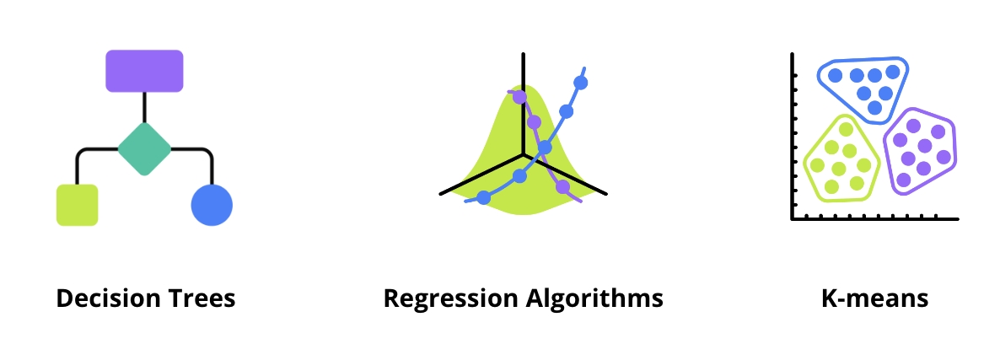
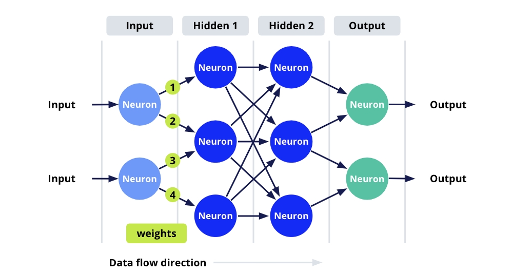
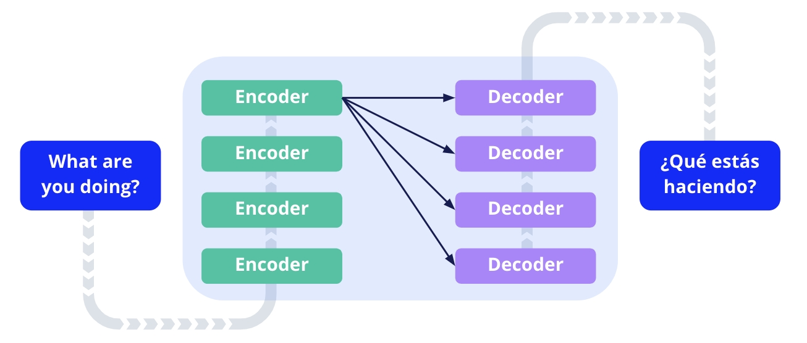
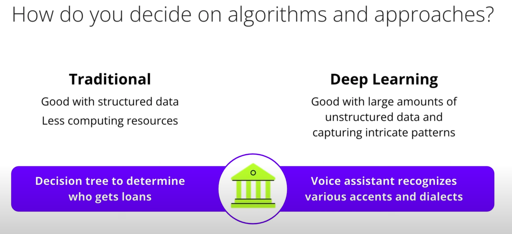
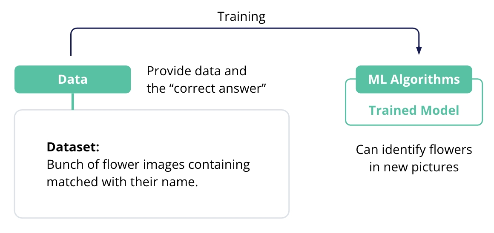
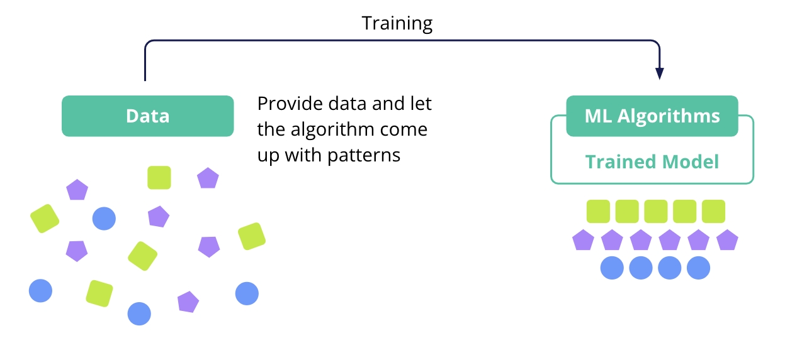
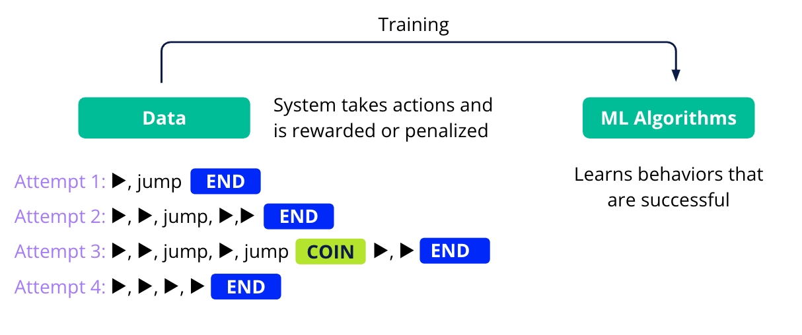
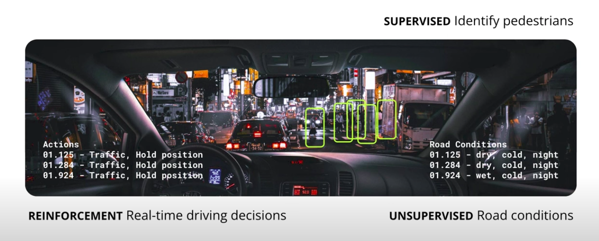
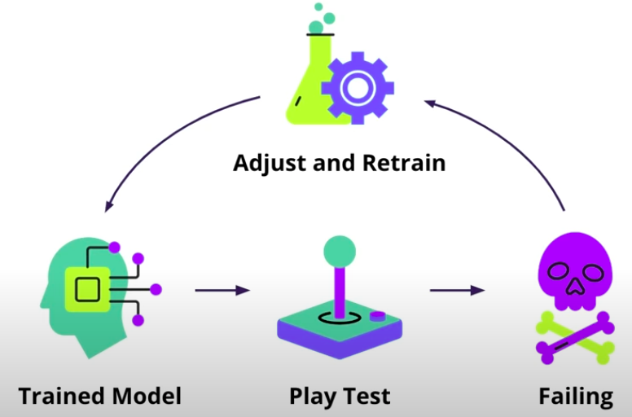

# 📘 Curso: Introducción a la IA Generativa con AWS Educate

## **unidad 2 :Fundamentos de IA y Machine Learning**

## 📌 Conceptos Clave
>
> Escribe aquí las ideas centrales de la lección con tus propias palabras. Usa listas, diagramas o tablas si es necesario.

- Inteligencia Humana: es la capacidad humana que tenemos los humanos de tomar  y procesar informacion que nos ayude a ubicarnos y pueda ayudara tomar deciciones futuras.

- Inteligencia artificial (IA) : el esfuerzo por equipar a las máquinas con capacidades de procesamiento de información y toma de decisiones similares a las humanas.

- Puntos de datos : piezas individuales de información procesadas para la toma de decisiones.

- Certeza : El nivel de confianza en tomar una decisión basada en información procesada.

- Aprendizaje Automatico: Es la parte(Segmento) de la IA que describe como las maquinas pueden aprender de los datos para descubrir patrones en esos datos y luego hacer predicciones sobre datos futuros.

- Sistema de aprendizaje automático : la combinación armoniosa de datos, algoritmos de aprendizaje automático y un modelo de aprendizaje automático.

- Modelo de aprendizaje automático : el intelecto del sistema, que procesa datos a través de algoritmos para generar predicciones o decisiones.

- Entrenamiento - La etapa de nutrir el modelo mediante el procesamiento de datos a través del código del algoritmo ML.

- Prueba : el acto de evaluar la eficacia del modelo utilizando datos nuevos, después del entrenamiento.

- Iteración : el ciclo de ajuste de algoritmos y datos, junto con el reentrenamiento, con el objetivo de mejorar el rendimiento del modelo.

---

## 🧠 Explicación en mis palabras
>
> Reformula lo aprendido como si se lo explicaras a alguien que no sabe del tema.

 Inteligencia Artificial: es esa busqueda o recreacion por medio de algoritmos y programas de software la capacidad a una maquina (PC) de replicar esta habilidad humana de procesr informacion y en base a ella tomar deciciones, identificar patrones y predecir el futuro de cierta forma.

 **ML Algoritmos**: ML Algorithms are code and mathematics, son creados a lo largo de la historia y evolucion de la inteligencia artificial, estan disponibles gratuitamente y son de código abierto. se puede o pueden escogen entre esatas opciones disponibles y personalizarlas para su proyecto de aprendizaje automatico.

 contruir un modelo de machine learning implica elegir:

- elegir, recopilar y seleccionar datos.
- elegir los algoritmos y los enfoques del modelo.
- Entrenar el modelo con mis datos para probar, ajustar y optimizar su rendimiento. 

### Enfoques tradiccionales de machine learning



 un enfoque muy basico son **los árboles de decisión**. para entenderlo vamos a desglosarlo poco a poco.

  Entendemoslos con  estructuras similares a un diagrama de flujo, donde cada nodo representa un aspecto o caracteristica de los datos y cada rama representa la decisión como una regla y cada hoja representa un resultado

  un ejemplo claro de este enfoque es **quieres jugar al tennis en funcion de las condiciones climaticas, un arbol de estos podria ayudarte a ramificar condiciones como si hace sol lo hay probabilidad de lluvia .

otro enfoque tradicional es **Regression Algorithms** este es un método estadístico que modela la **Relacion** entre una variable dependiente y una o mas variables independientes con la finalidad de predecir vallores numericos.

Algoritmos de agrupamiento como K-Means, este algorirmo lo que hace es agrupar los datos en clústers en funcion de su similitud 

como por ejemplo tenemos que podemos emplear estos algoritmos de ordenamiento para segmentar y categorizar datos de los sensores de vehiculos autonomos. estos datos usualmente se almacenan en nubes de puntos y agrupaciones de clusters pueden ayudar a agrupar estos puntos para identificar objetos u obstaculos al rededor del automóvil

a medida que los algoritmos de ML avanzaron y evolucionaron la computacion se volvio mas poderosa y confiable y un nuevo enfoque de ML comenzóa impulzar la IA este es el **Deep Learning** este tipo de aprfendizaje profundo esta soportado o inspirado en la estrutura y funcion del cerebro humano mas concretamente en las redes neuronales, utilizar **algoritmos llamados redes neuronales artificiales** que consisten en nueronas interconectadas. los modelos deep learning en especial los que tienen muchas capas profundas se destacan en el procesamiento de grandes cantidades de datos y **son cruciales en tareas como el reconocimiento de imagen y voz**. 

 

en lugar de estar programado explicitamente para realizar estas tareas, aprende patrones de los datos a medida que intrudicimos datos en la red neuronal el modelo ajusta sus pesos internos en funcion de la   diferencia entre su salida y el resultado deseado. a este proceso le llamamos entrenamiento, esta capacidad permite que estos sistemas extraigan y aprendan 
automaticamente características complejas de los datos sin procesar. les permite lograr una alta precisión en tareas complejas uno ejemplos de sus funcionalidades son cuando identifican a alguien para etiquetarlo en redes sociales.

- Pueden tambien encontrar en sistemas de prediccion de precios de acciones o modelos de prediccion de perdida de clientes donde el sistema anticipa si un cliente dejara de usar un servicio en funcion de su comportamiento pasado.

- las CNN Convolutional Neural Network ( Redes Neuronales Convolucionales) son uan version especializada de las redes neuronales diseñadas para tareas de visión destacandose por mantener el contexto espacial de la imagen, campurando caracteristicas relevantes, esta tecnologia impulsa cosas como photo search.

- las RNN Recurrent Neural Network o redes neuronales recurrentes **tiene conexiones que se repiten en sentido inverso** esta arquitectura las hace especiales para datos secuenciales como series de tiempo o lenguaje natural. son habiles en predicción de secuencias como predecir la siguiente palabra en una oración. utile en bots y prediccion al escribir en el teclado o buscadores. son expertas en manejo de datos secuenciales lo que hace buenas para tareas como prediccion de series de tiempo en precios de acciones. 

### Generative Deep Learning 

 la IA generativa tambien se sirve de el Deep Learning, estos modelos tienen como **objetivo: generar nuevas muestras de datos que sean similares a los datos de entrada se puede utilizar a menudo para crear contenido nuevo o simular datos. 

 - Se podria usar por ejemplo para entrenar un modelo generativo para componer nuevas canciones aprendiendo los patrones y estructuras de la música existente.**las acquitecturas de transformers, una combinacion de enfoques de ML que consisten en codificadores y decodificadores, tambien utiliza aprendizaje profundo.** los codificadores procesan los datos de entrada mientras que los decodificadores producen la salida al igual que las redes neuronales profundas, los trasnformers constan de múltiples capas de computacion a medida que los datos de entrada avanzan a travéz de estas capas, se extraen patrones y caracteristicas cada vez mas complejas, en modelos de transformers mucho mas profundos, puede haber docenas o incluso cientos, de estas capas. este enfoque es definitivo en tareas como traduccion o generacion de codigo, a mejorado el NLP permitiendo que estos modelos entiendan en lenguaje mejor que nunca.

 ### How do you decide on algorithms an approaches? 
 

 la decisión de qué algoritmo o modelo utilizar depende de los datos,el problema y los recursos disponibles 


 **Modelos**:

---

## ❓ Preguntas activas (Active Recall)

> Escribe preguntas para repasar el contenido sin mirar los apuntes. Esto entrena la recuperación activa.

- ¿Qué es...?
- ¿Por qué sucede...?
- ¿Cuál es la diferencia entre... y...?
- ¿Cómo se aplica... en la vida real?
- ¿Qué implica éticamente...?

---

## 💬 Interrogación elaborativa
>
> ¿Por qué es importante este concepto? ¿Cómo se conecta con cosas que ya sé?

- [Explicación reflexiva aquí]
- [Conexiones con conocimientos previos]

- Cuando ya definimos segun nuestra tarea a resolver, que tipo de aprendizaje voy a utilizar el siguiente paso es definir o escoger el enfoque o algoritmo a utilizar para contruir mi modelo

---

## 🔁 Aplicaciones y ejemplos
>
> Usa casos reales, analogías o visualizaciones para darle contexto a los conceptos.

- Ejemplo 1 de **Inteligencia Artificial**:
  - Considera la capacidad humana de identificar una cancion,cuando experimentas con la musica, recopilas todo tipo de informacion de lo que suena  (osea lo que estas escuchando), como la letra de la cancion, el video, el artista, el nombre, canciones similares y como se puede relacionar con otras canciones similares todo esto es informacion y **Son datos cruciales que tu cerebro procesa sobrfe la cancion para poder aprenderla.

  Cuando te encuentras con una cancion similar, puedes si la escuchas llegar a identificar otras canciones similares que son del mismo artista como si estuvieras 90% seguro de que es el mismo artista, aunque hay un 10% de posibilidad de que estes equivocado.

   **Ahora como podemos replicar esto en un telefono o PC**

   la capacidad de aprender la cancion e identificar el artista con un porcentage de certeza de 90% igual que nosotros los humanos, entonces exploremos las diferentes formas en que podemos crear maquinas que procesen informacion para fundamentar decisiones futuras y computadoras que puedan realizar acciones/tareas inteligentes

- Analogía: "Es como..."

- Caso real:

- Cuando queremos enseñarle algo a una computadora tenemos que construir un sistema de aprendizaje automatico. en ML Utilizamos código para enseñar a un sistema informatico a aprender por si solo sin darle instrucciones paso a paso, como:
  - A este codigo nos referimos como algoritmo de aprendizaje automatico, estos a su vez estan escritos en una variedad de lenguaje de programacion y veremos su anatomia.

  ### Anatomia de un sistema de Machine Learning

  

  describiremos las partes de un sistema de ML:
  - **Datos**: Los datos son la base de cualquier sistema de ML. estos proporcionan la informacion que el sistema utiliza para aprender, en este caso puede ser cualquier tipo de punto de datos/Tipo, como lo son imagenes, texto,pixeles, numeros, o cualquier otro tipo de datos.
  
  - **ML Algorithms**: Los los datos se procesan mediante el código del algoritmo de ML , este es un conjunto de reglas y patrones que describen como procesar la informacion(Datos), lso modelos de ML y la forma en que aprende  de los datos se le denomina **Modelo de Machine Learning** este es el cerebro del sistema.  

    Utiliza algoritmos para procesar los datos y hacer predicciones o tomar decisiones basadas en esos datos.

  - Una vez ya tengamos nuestros datos y hayamos elegido el algoritmo para el modelo de aprendizaje de ML, **entrenamos el modelo**. el proyecto comienza aca lo entyrenamos mediante el algoritmo designado

    siendo esta la fase en la cual el algoritmo se ejecuta y procesara todos los datos y se producirá el aprendizaje.
  
  - Despues de el entrenamiento se prueba el rendimiento del modelo con nuevos datos, esto es el testing, es como medimos su desempeño en la tarea/tareasb para las cuales a sido entrenado

  este proceso mediante un ciclo de entrenamiento, prueba y ajuste, buscamos optimizar el rendimiento del modelo, la busqueda de esta optmizacion es optimizar el rendimeinto del modelo para dar en el blanco, triunfando en nuestro objetivo sea cual sea ese el motivo del desarrollo del modelo.

  ### Types Of Machine Learning

  Los tipos de Machine Learning dependen y varían en función de la data que vas a utilizar y la tarea que quieres resolver mediante el uso de ML, o sea, para qué quieres usar ML o qué buscas resolver a través de ML.

  - **Supervised Learning**: Una forma de describir este sería algo como aprender de un maestro; le proporcionas datos al modelo que elegiste previamente y le dices la respuesta correcta para cada punto de datos. Como en el ejemplo, el modelo aprende de estas imágenes y etiquetas, pudiendo identificar imágenes (iguales) en el futuro, nuevas e inéditas. En este tipo de aprendizaje, los datos de entrenamiento proporcionados al algoritmo de ML están etiquetados.

  

  **When to Use**

  Usa este tipo de entrenamiento en ML si tienes datos etiquetados y deseas que el modelo aprenda una asignación de entradas a salidas. Algunos problemas comunes que se pueden resolver con un enfoque supervisado son:

  - Clasificación de imágenes
  - Speech Recognition (audios etiquetados con lo que se escuche en el mismo)
  - Se puede usar también para crear un sistema de aprendizaje automático para un automóvil que pueda conducirse solo. Su uso principal acá es para tareas como identificar peatones, otros automóviles y detectar carriles. El modelo procesaría datos de video etiquetados que identifican cruces de peatones, personas, marcas en la calle, así como las respuestas correctas a tomar.
  - Si tenemos conjuntos de datos etiquetados de canciones y sus artistas asociados.
  - Problema en el área bancaria: Fraude bancario, se puede entrenar un modelo en transacciones bancarias que estén etiquetadas como fraudulentas o genuinas.

  - **Unsupervised Learning**:
    Es lo opuesto al supervisado, imagina tener que comprender algo sin una guía. Acá le das una gran cantidad de datos al modelo y dejas que él encuentre patrones y estructuras por sí solo. Estos datos proporcionados al modelo no contienen etiquetas para aprender y predecir la respuesta correcta, sino que debe identificar patrones en los mismos datos. **Es como entregarle a alguien un rompecabezas sin mostrarle la imagen de la caja**. Esto puede resultar beneficioso ya que permite identificar una gran cantidad de datos donde las etiquetas a menudo no están disponibles. Piensa en recopilar todos los datos de internet: habrá diferentes tipos de datos ahí, texto, imagen y video, y no estarán etiquetados de ninguna manera útil. ¿Qué patrones se pueden aprender de todos esos datos?

  

  - **When to use: Use cases**
    Elige utilizar el aprendizaje no supervisado cuando no tengas datos etiquetados y desees que el modelo encuentre estructuras o patrones en los datos.

    - Se puede utilizar para, por ejemplo, **enseñar a una computadora a escribir una canción**; al procesar los datos sin etiquetas puede identificar patrones en canciones existentes y guiar la creación de nuevas melodías o ritmos.
    - También se puede usar para crear **modelos generativos que puedan escribir código por usted**.

    Este tipo de aprendizaje puede identificar estructuras o patrones comunes en fragmentos de código existente y aprender cuándo usarlos, pero esta identificación no es suficiente para completar esta tarea. El aprendizaje no supervisado a menudo se combina con otras técnicas para lograr un modelo que pueda escribir canciones y código.

  - **Reinforcement Learning**
  

  Este es muy diferente a los otros tipos de aprendizaje; esto es aprender **por ensayo y error**. Algo que lo pueda ejemplificar es cómo se entrena un perro por un sistema de incentivo de recompensa o castigo que guíe su comportamiento, maximizando el comportamiento deseado y así aprendiendo lo que se quiere que él haga.

  El sistema realiza una acción y, si es la acción correcta, obtiene una recompensa. Y si es la acción incorrecta, podría recibir una penalización. Con el tiempo, el sistema aprende a tomar decisiones que maximicen sus recompensas.

  Podríamos ver un ejemplo popular en los videojuegos, donde la IA aprende estrategias óptimas al jugar el juego repetidamente. En el RL, el algoritmo aprende a partir de la experiencia y la experimentación (ensayo y error).

  - **Use Cases**
    Esta es la opción correcta cuando deseas que tu modelo aprenda interactuando con un entorno y recibiendo recompensas o penalizaciones por sus acciones. Como tal, no se requieren datos etiquetados, solo comentarios sobre el rendimiento. Se utiliza cuando:

    - Quiero modelos de ML para juegos y en robótica; podemos enseñarle a una máquina a jugar videojuegos, esta interactúa con el juego realizando acciones, recibiendo así recompensas o penalizaciones en función de sus acciones y así perfeccionando su estrategia.
    - También en aspectos de toma de decisiones de un automóvil autónomo, donde el automóvil aprende estrategias de conducción óptimas al interactuar con su entorno. En el mundo real, muchos problemas, en especial los complejos, implican una combinación de estos tipos de aprendizajes. Cuando utilizamos una combinación de aprendizajes, a menudo significa que se están utilizando múltiples modelos o componentes de un sistema de IA más grande, donde cada modelo podría manejar una tarea específica. Como en un carro autónomo, podría haber un modelo entrenado por SL que detecte peatones, otro modelo de UL se encarga de agrupar tipos de condiciones de la carretera y otro utiliza el aprendizaje por refuerzo para tomar decisiones de conducción en tiempo real basadas en condiciones dinámicas. Estos modelos, trabajando juntos, cada uno aporta su pieza al rompecabezas y ayuda a que el sistema funcione de manera cohesiva. Es como tener especialistas en un grupo donde cada uno aporta su experiencia para lograr un objetivo común. Así podemos lograr tareas complejas con Inteligencia Artificial.

  

  ### Practice Using Jupyter Notebook

  Jupyter es un entorno de progrmacion optimizado para DS y ML, este formato esta diseñado para escribir y ejecutar en celdas

  ---

## 🔧 Implementación práctica
>
> ¿Cómo puedo usar esto en mi vida, estudio, trabajo o proyectos?

- Proyecto/idea:

  - ### Machine Learning to game

    Para nuestro bot de videojuego que ilustra mejor la idea del Machine Learning, haremos que juegue un juego y veremos cómo lo hace; su rendimiento nos permite saber la precisión y confiabilidad de ese modelo.

    Puede que juegue mal y tome decisiones incorrectas, quizás solo funcione bien solo un tiempo o falle de manera reiterada en una parte del juego.

    Si esto sucede, tendremos que volver atrás y ajustar los algoritmos y los datos y entrenar el modelo otra vez para que, con suerte, funcione mejor.

    

    Una vez que el modelo ha sido entrenado y juega muy bien, está listo para usar (jugar) en el mundo real; el robot que juega puede ser tu nuevo compañero de juego.

    >*Esto suena fácil pero, en realidad, hay muchas decisiones que tomar sobre cada parte de un sistema de aprendizaje automático para lograr un sistema que de verdad funcione realmente bien, para que pueda jugar bien un juego y ganar o adivinar el artista de una canción con un 90% de precisión.*

- Automatización o uso en herramientas:

  veremos cómo es uno de esos modelos y cómo se puede utilizar. En este caso, AWS ofrece una gama de servicios con modelos altamente precisos y previamente entrenados para tareas comunes. Esto significa que, si no deseas entrenar y luego tener que administrar tus propios modelos, puedes utilizar estos servicios si satisfacen tus necesidades.

  Entrando a AWS AI Services puedes ver todas tus posibilidades, entre ellas la que utilizaremos para este caso, que es **Amazon Rekognition**. Este utiliza tecnología de deep learning para analizar imagen y video (no necesitas experiencia en deep learning previamente), solo proporcionando una imagen ya te proporciona un análisis.

  El reconocimiento puede realizar una variedad de funciones diferentes, desde el análisis facial hasta la detección de celebridades en imágenes. En este caso práctico de la herramienta, la utilizaremos para la tarea de: identificar objetos en una imagen y etiquetar dichos objetos. En Amazon Rekognition hay algunas demostraciones disponibles que te permiten cargar imágenes y realizar un análisis para ver si el servicio cumplirá con tus requisitos.

  

  En este caso veremos el ejemplo del demo para detección de etiquetas. Cuando entramos aquí, vemos una imagen de muestra que proporciona el sistema Rekognition, donde se detectan los objetos o entidades en la imagen. Cuando este identifica, enmarca dichos objetos o entidades en un recuadro, separándolos del resto de la imagen, creando la delimitación clara y los etiqueta.

  

  Como vemos, al lado derecho de la imagen podemos encontrar la parte de resultados donde puntúa con un porcentaje de confianza el etiquetado de cada elemento u objeto detectado en la imagen. Es importante saber que estos modelos solo brindan una predicción y un puntaje de confianza; esas predicciones no necesariamente son 100% correctas todo el tiempo. Si bien esta consola solo es de demostración, es ideal para probar estos servicios, pero si ya quieres realizar una integración de este servicio a una aplicación real, entonces llamarías a la API de reconocimiento, que te permite enviar imágenes mediante programación y recibir esta información a cambio. Por ejemplo, lo que enviaríamos al servicio de reconocimiento sería, esto que lo puedes encontrar en la parte inferior del lado derecho, como:

  ```json
    {
      "Image": {
        "Bytes": "..."
      }
    }
  ```

  Esto es un documento de JSON con la imagen representada por una serie de Bytes. En este ejemplo son solo puntos, pero si fuera algo real, luciría como el ejemplo siguiente:

  ```json
    {
       "Image": {
          "Bytes": "/9j/4AAQSkZJRgABAQAAAQABAAD/2wCEAAkGBxISEhISEhIVFhUVFRUVFRUVFRUVFRUXFxUXFxcVFRUYHSggGBolHRcVITEhJSkrLi4uFx8zODMsNygtLisBCgoKDg0OGxAQGi0fICUtLS0tLS0tLS0tLS0tLS0tLS0tLS0tLS0tLS0tLS0tLS0tLS0tLS0tLS0tLS0tLf/AABEIAKMBNwMBIgACEQEDEQH/xAAbAAEAAgMBAQAAAAAAAAAAAAAABQYBBAIDB//EADwQAAEDAgQDBgMGBgICAwAAAAEAAhEDIQQSMQVBUWEGEyJxgZGhFCNCUrHR8BQjYnKS0fAzQ1NicoKT..."
         }
    }
  ```

  En este ejemplo, la imagen real está codificada en **base64**, siendo un ejemplo truncado de la imagen codificada (normalmente sería mucho más largo, con miles de caracteres).

  Más abajo de esa parte también está el formato JSON para la respuesta (lo que nos estaría enviando y genera la API de Amazon Rekognition). En este ejemplo, además de las etiquetas detectadas, se incluye la información de los recuadros delimitadores (bounding boxes) que identifican visualmente la ubicación de los objetos encontrados en la imagen. Por ejemplo, cuando Rekognition detecta un "Railway", también puede devolver las coordenadas del recuadro que lo delimita dentro de la imagen:

  ```json
  {
    "Labels": [
      {
        "Name": "Railway",
        "Confidence": 99.49,
        "Instances": [
          {
            "BoundingBox": {
              "Width": 0.85,
              "Height": 0.12,
              "Left": 0.07,
              "Top": 0.78
            },
            "Confidence": 99.49
          }
        ],
        "Parents": [
          {
            "Name": "Transportation"
          }
        ],
        "Aliases": [
          {
            "Name": "Rail"
          },
          {
            "Name": "Train Track"
          }
        ],
        "Categories": [
          {
            "Name": "Transport and Logistics"
          }
        ]
      }
    ],
    "LabelModelVersion": "3.0",
    "ResponseMetadata": {
      "RequestId": "1a2b3c4d-5678-90ab-cdef-EXAMPLE11111",
      "HTTPStatusCode": 200,
      "HTTPHeaders": {
        "x-amzn-requestid": "1a2b3c4d-5678-90ab-cdef-EXAMPLE11111",
        "content-type": "application/x-amz-json-1.1",
        "content-length": "456",
        "date": "Wed, 25 Jun 2025 05:00:00 GMT"
      },
      "RetryAttempts": 0
    }
  }
  ```

  En la sección `"Instances"` se encuentra el objeto `"BoundingBox"`, que indica la posición y tamaño del recuadro en la imagen (los valores son proporcionales al ancho y alto de la imagen, entre 0 y 1). Así, Amazon Rekognition no solo identifica qué objetos hay en la imagen, sino también exactamente dónde están ubicados, permitiendo resaltarlos visualmente con recuadros.

  Una de las cosas más importantes del código que nos da la API es la identificación de entidades en la imagen, como el tren con una confianza del 99,49% de que es un tren. También genera un cuadro delimitador en la entidad u objeto; esto ayuda a saber no solo que hay un tren en la imagen, sino dónde está ese tren u objeto en la imagen.

  Como final, encontramos que si queremos usar la IA para solucionar un problema común, verifiquemos si existen modelos o servicios que puedan utilizar en lugar de desarrollar e implementar sus modelos desde cero.

### Demostracion: Aprendizaje Automatico

---

## 🧭 Reflexión personal
>
> ¿Cómo me cambia esto? ¿Qué pienso al respecto? ¿Qué dudas tengo?

- [Reflexión aquí]

---

## 🔁 Repasos programados (espaciados)
>
> Planifica repasar este contenido según una curva de repetición.

- 📅 Primer repaso: [fecha]
- 📅 Segundo repaso: [fecha]
- 📅 Tercer repaso: [fecha]

---

## 🧩 Vocabulario técnico
>
> Lista breve de términos nuevos o importantes.

| Término       | Definición breve                         |
|--------------|------------------------------------------|
| IA           | Inteligencia Artificial, ...             |
| Aprendizaje automático | Técnica de IA que ...            |

---

## 📚 Recursos adicionales
>
> Links, libros, papers o videos para ampliar el tema.

- [Nombre del recurso](URL) - Breve descripción
