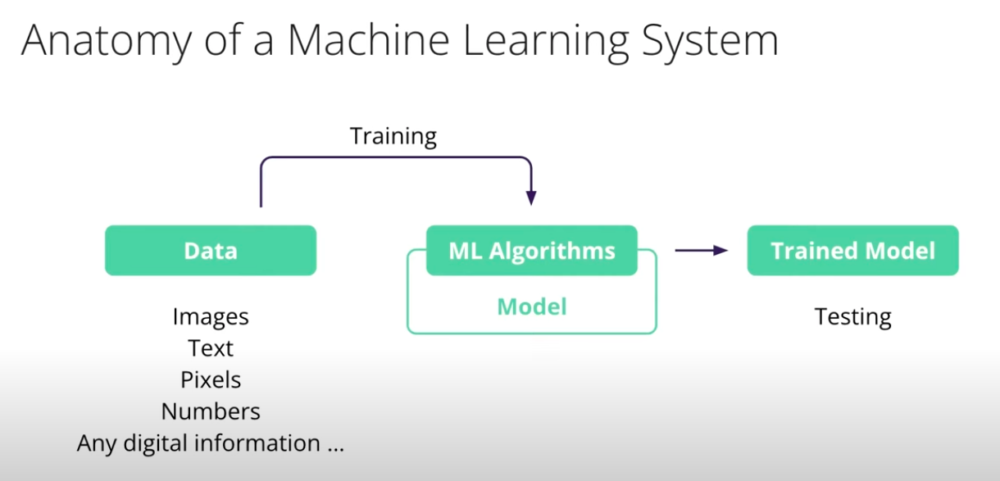

# 📘 Curso: Introducción a la IA Generativa con AWS Educate

##  **unidad 2 :Fundamentos de IA y Machine Learning**
 
## 📌 Conceptos Clave
> Escribe aquí las ideas centrales de la lección con tus propias palabras. Usa listas, diagramas o tablas si es necesario.

- Inteligencia Humana: es la capacidad humana que tenemos los humanos de tomar  y procesar informacion que nos ayude a ubicarnos y pueda ayudara tomar deciciones futuras. 

- Inteligencia artificial (IA) : el esfuerzo por equipar a las máquinas con capacidades de procesamiento de información y toma de decisiones similares a las humanas.


- Puntos de datos : piezas individuales de información procesadas para la toma de decisiones.

- Certeza : El nivel de confianza en tomar una decisión basada en información procesada.

- Aprendizaje Automatico: Es la parte(Segmento) de la IA que describe como las maquinas pueden aprender de los datos para descubrir patrones en esos datos y luego hacer predicciones sobre datos futuros.


- Sistema de aprendizaje automático : la combinación armoniosa de datos, algoritmos de aprendizaje automático y un modelo de aprendizaje automático.

- Modelo de aprendizaje automático : el intelecto del sistema, que procesa datos a través de algoritmos para generar predicciones o decisiones.

- Entrenamiento - La etapa de nutrir el modelo mediante el procesamiento de datos a través del código del algoritmo ML.

- Prueba : el acto de evaluar la eficacia del modelo utilizando datos nuevos, después del entrenamiento.

- Iteración : el ciclo de ajuste de algoritmos y datos, junto con el reentrenamiento, con el objetivo de mejorar el rendimiento del modelo.


---

## 🧠 Explicación en mis palabras
> Reformula lo aprendido como si se lo explicaras a alguien que no sabe del tema.

 Inteligencia Artificial: es esa busqueda o recreacion por medio de algoritmos y programas de software la capacidad a una maquina (PC) de replicar esta habilidad humana de procesr informacion y en base a ella tomar deciciones, identificar patrones y predecir el futuro de cierta forma. 

---

## ❓ Preguntas activas (Active Recall)
> Escribe preguntas para repasar el contenido sin mirar los apuntes. Esto entrena la recuperación activa.

- ¿Qué es...?
- ¿Por qué sucede...?
- ¿Cuál es la diferencia entre... y...?
- ¿Cómo se aplica... en la vida real?
- ¿Qué implica éticamente...?

---

## 💬 Interrogación elaborativa
> ¿Por qué es importante este concepto? ¿Cómo se conecta con cosas que ya sé?

- [Explicación reflexiva aquí]
- [Conexiones con conocimientos previos]

---

## 🔁 Aplicaciones y ejemplos
> Usa casos reales, analogías o visualizaciones para darle contexto a los conceptos.

- Ejemplo 1 de **Inteligencia Artificial**: 
  * Considera la capacidad humana de identificar una cancion,cuando experimentas con la musica, recopilas todo tipo de informacion de lo que suena  (osea lo que estas escuchando), como la letra de la cancion, el video, el artista, el nombre, canciones similares y como se puede relacionar con otras canciones similares todo esto es informacion y **Son datos cruciales que tu cerebro procesa sobrfe la cancion para poder aprenderla.

  Cuando te encuentras con una cancion similar, puedes si la escuchas llegar a identificar otras canciones similares que son del mismo artista como si estuvieras 90% seguro de que es el mismo artista, aunque hay un 10% de posibilidad de que estes equivocado. 
   
   **Ahora como podemos replicar esto en un telefono o PC** 

   la capacidad de aprender la cancion e identificar el artista con un porcentage de certeza de 90% igual que nosotros los humanos, entonces exploremos las diferentes formas en que podemos crear maquinas que procesen informacion para fundamentar decisiones futuras y computadoras que puedan realizar acciones/tareas inteligentes 

- Analogía: "Es como..."

- Caso real: 

- Cuando queremos enseñarle algo a una computadora tenemos que construir un sistema de aprendizaje automatico. en ML Utilizamos código para enseñar a un sistema informatico a aprender por si solo sin darle instrucciones paso a paso, como: 
  * A este codigo nos referimos como algoritmo de aprendizaje automatico, estos a su vez estan escritos en una variedad de lenguaje de programacion y veremos su anatomia. 

  ### Anatomia de un sistema de Machine Learning 
  

  describiremos las partes de un sistema de ML: 
  - **Datos**: Los datos son la base de cualquier sistema de ML. estos proporcionan la informacion que el sistema utiliza para aprender, en este caso puede ser cualquier tipo de punto de datos/Tipo, como lo son imagenes, texto,pixeles, numeros, o cualquier otro tipo de datos. 
  

  - **ML Algorithms**: Los los datos se procesan mediante el código del algoritmo de ML , este es un conjunto de reglas y patrones que describen como procesar la informacion(Datos), lso modelos de ML y la forma en que aprende  de los datos se le denomina **Modelo de Machine Learning** este es el cerebro del sistema.  

    Utiliza algoritmos para procesar los datos y hacer predicciones o tomar decisiones basadas en esos datos.

  - Una vez ya tengamos nuestros datos y hayamos elegido el algoritmo para el modelo de aprendizaje de ML, **entrenamos el modelo**. el proyecto comienza aca lo entyrenamos mediante el algoritmo designado 

    siendo esta la fase en la cual el algoritmo se ejecuta y procesara todos los datos y se producirá el aprendizaje.
  
  - Despues de el entrenamiento se prueba el rendimiento del modelo con nuevos datos, esto es el testing, es como medimos su desempeño en la tarea/tareasb para las cuales a sido entrenado 

  este proceso mediante un ciclo de entrenamiento, prueba y ajuste, buscamos optimizar el rendimiento del modelo, la busqueda de esta optmizacion es optimizar el rendimeinto del modelo para dar en el blanco, triunfando en nuestro objetivo sea cual sea ese el motivo del desarrollo del modelo. 


---

## 🔧 Implementación práctica
> ¿Cómo puedo usar esto en mi vida, estudio, trabajo o proyectos?

- Proyecto/idea: 
  - ### Machine Learning to game 
    Para nuestro bot de videojuego que ilustra mejor la idea del Machine Learning, haremos que juegue un juego y veremos cómo lo hace; su rendimiento nos permite saber la precisión y confiabilidad de ese modelo. 

    Puede que juegue mal y tome decisiones incorrectas, quizás solo funcione bien solo un tiempo o falle de manera reiterada en una parte del juego.

    Si esto sucede, tendremos que volver atrás y ajustar los algoritmos y los datos y entrenar el modelo otra vez para que, con suerte, funcione mejor.

    

    Una vez que el modelo ha sido entrenado y juega muy bien, está listo para usar (jugar) en el mundo real; el robot que juega puede ser tu nuevo compañero de juego.

    >*Esto suena fácil pero, en realidad, hay muchas decisiones que tomar sobre cada parte de un sistema de aprendizaje automático para lograr un sistema que de verdad funcione realmente bien, para que pueda jugar bien un juego y ganar o adivinar el artista de una canción con un 90% de precisión.*
 

- Automatización o uso en herramientas: 

  veremos cómo es uno de esos modelos y cómo se puede utilizar. En este caso, AWS ofrece una gama de servicios con modelos altamente precisos y previamente entrenados para tareas comunes. Esto significa que, si no deseas entrenar y luego tener que administrar tus propios modelos, puedes utilizar estos servicios si satisfacen tus necesidades.

  Entrando a AWS AI Services puedes ver todas tus posibilidades, entre ellas la que utilizaremos para este caso, que es **Amazon Rekognition**. Este utiliza tecnología de deep learning para analizar imagen y video (no necesitas experiencia en deep learning previamente), solo proporcionando una imagen ya te proporciona un análisis.

  El reconocimiento puede realizar una variedad de funciones diferentes, desde el análisis facial hasta la detección de celebridades en imágenes. En este caso práctico de la herramienta, la utilizaremos para la tarea de: identificar objetos en una imagen y etiquetar dichos objetos. En Amazon Rekognition hay algunas demostraciones disponibles que te permiten cargar imágenes y realizar un análisis para ver si el servicio cumplirá con tus requisitos.

  

  En este caso veremos el ejemplo del demo para detección de etiquetas. Cuando entramos aquí, vemos una imagen de muestra que proporciona el sistema Rekognition, donde se detectan los objetos o entidades en la imagen. Cuando este identifica, enmarca dichos objetos o entidades en un recuadro, separándolos del resto de la imagen, creando la delimitación clara y los etiqueta.

  

  Como vemos, al lado derecho de la imagen podemos encontrar la parte de resultados donde puntúa con un porcentaje de confianza el etiquetado de cada elemento u objeto detectado en la imagen. Es importante saber que estos modelos solo brindan una predicción y un puntaje de confianza; esas predicciones no necesariamente son 100% correctas todo el tiempo. Si bien esta consola solo es de demostración, es ideal para probar estos servicios, pero si ya quieres realizar una integración de este servicio a una aplicación real, entonces llamarías a la API de reconocimiento, que te permite enviar imágenes mediante programación y recibir esta información a cambio. Por ejemplo, lo que enviaríamos al servicio de reconocimiento sería, esto que lo puedes encontrar en la parte inferior del lado derecho, como:

  ```json
    {
      "Image": {
        "Bytes": "..."
      }
    }
  ```
  Esto es un documento de JSON con la imagen representada por una serie de Bytes. En este ejemplo son solo puntos, pero si fuera algo real, luciría como el ejemplo siguiente:

  ```json
    {
       "Image": {
          "Bytes": "/9j/4AAQSkZJRgABAQAAAQABAAD/2wCEAAkGBxISEhISEhIVFhUVFRUVFRUVFRUVFRUXFxUXFxcVFRUYHSggGBolHRcVITEhJSkrLi4uFx8zODMsNygtLisBCgoKDg0OGxAQGi0fICUtLS0tLS0tLS0tLS0tLS0tLS0tLS0tLS0tLS0tLS0tLS0tLS0tLS0tLS0tLS0tLf/AABEIAKMBNwMBIgACEQEDEQH/xAAbAAEAAgMBAQAAAAAAAAAAAAAABQYBBAIDB//EADwQAAEDAgQDBgMGBgICAwAAAAEAAhEDIQQSMQVBUWEGEyJxgZGhFCNCUrHR8BQjYnKS0fAzQ1NicoKT..."
         }
    }
  ```
  En este ejemplo, la imagen real está codificada en **base64**, siendo un ejemplo truncado de la imagen codificada (normalmente sería mucho más largo, con miles de caracteres).

  Más abajo de esa parte también está el formato JSON para la respuesta (lo que nos estaría enviando y genera la API de Amazon Rekognition). En este ejemplo, además de las etiquetas detectadas, se incluye la información de los recuadros delimitadores (bounding boxes) que identifican visualmente la ubicación de los objetos encontrados en la imagen. Por ejemplo, cuando Rekognition detecta un "Railway", también puede devolver las coordenadas del recuadro que lo delimita dentro de la imagen:

  ```json
  {
    "Labels": [
      {
        "Name": "Railway",
        "Confidence": 99.49,
        "Instances": [
          {
            "BoundingBox": {
              "Width": 0.85,
              "Height": 0.12,
              "Left": 0.07,
              "Top": 0.78
            },
            "Confidence": 99.49
          }
        ],
        "Parents": [
          {
            "Name": "Transportation"
          }
        ],
        "Aliases": [
          {
            "Name": "Rail"
          },
          {
            "Name": "Train Track"
          }
        ],
        "Categories": [
          {
            "Name": "Transport and Logistics"
          }
        ]
      }
    ],
    "LabelModelVersion": "3.0",
    "ResponseMetadata": {
      "RequestId": "1a2b3c4d-5678-90ab-cdef-EXAMPLE11111",
      "HTTPStatusCode": 200,
      "HTTPHeaders": {
        "x-amzn-requestid": "1a2b3c4d-5678-90ab-cdef-EXAMPLE11111",
        "content-type": "application/x-amz-json-1.1",
        "content-length": "456",
        "date": "Wed, 25 Jun 2025 05:00:00 GMT"
      },
      "RetryAttempts": 0
    }
  }
  ```

  En la sección `"Instances"` se encuentra el objeto `"BoundingBox"`, que indica la posición y tamaño del recuadro en la imagen (los valores son proporcionales al ancho y alto de la imagen, entre 0 y 1). Así, Amazon Rekognition no solo identifica qué objetos hay en la imagen, sino también exactamente dónde están ubicados, permitiendo resaltarlos visualmente con recuadros.

  Una de las cosas más importantes del código que nos da la API es la identificación de entidades en la imagen, como el tren con una confianza del 99,49% de que es un tren. También genera un cuadro delimitador en la entidad u objeto; esto ayuda a saber no solo que hay un tren en la imagen, sino dónde está ese tren u objeto en la imagen.

  Como final, encontramos que si queremos usar la IA para solucionar un problema común, verifiquemos si existen modelos o servicios que puedan utilizar en lugar de desarrollar e implementar sus modelos desde cero.

### Demostracion: Aprendizaje Automatico

---

## 🧭 Reflexión personal
> ¿Cómo me cambia esto? ¿Qué pienso al respecto? ¿Qué dudas tengo?

- [Reflexión aquí]

---

## 🔁 Repasos programados (espaciados)
> Planifica repasar este contenido según una curva de repetición.

- 📅 Primer repaso: [fecha]
- 📅 Segundo repaso: [fecha]
- 📅 Tercer repaso: [fecha]

---

## 🧩 Vocabulario técnico
> Lista breve de términos nuevos o importantes.

| Término       | Definición breve                         |
|--------------|------------------------------------------|
| IA           | Inteligencia Artificial, ...             |
| Aprendizaje automático | Técnica de IA que ...            |

---

## 📚 Recursos adicionales
> Links, libros, papers o videos para ampliar el tema.

- [Nombre del recurso](URL) - Breve descripción

